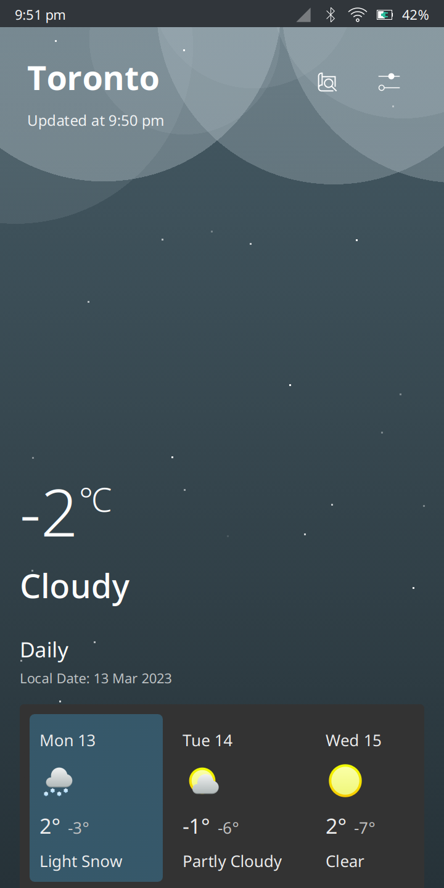
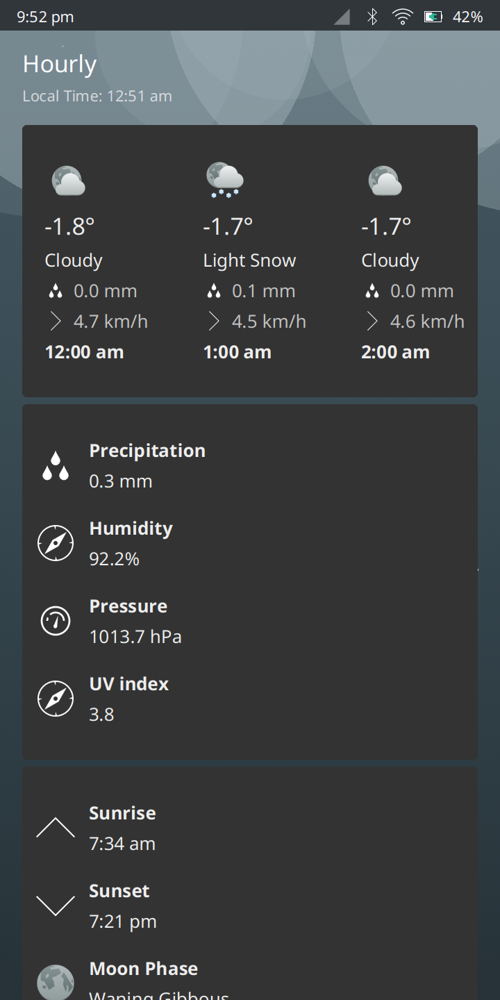
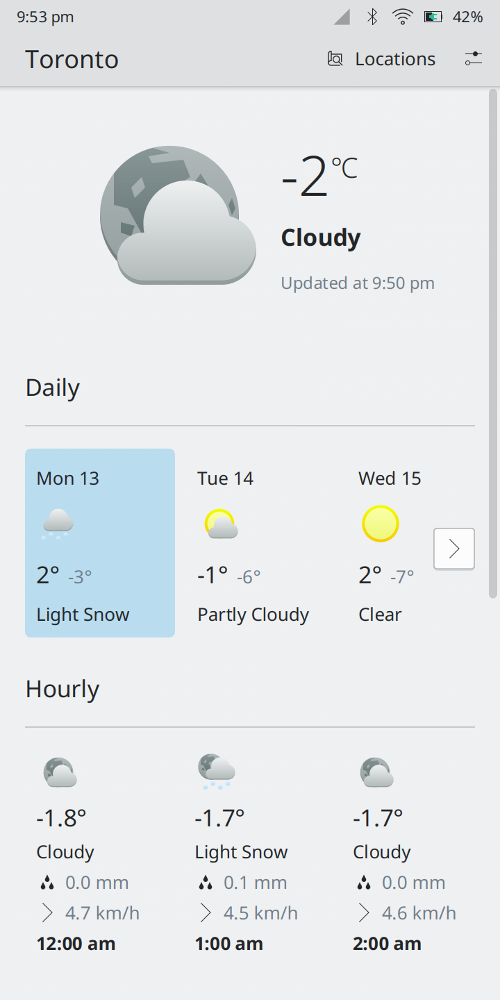
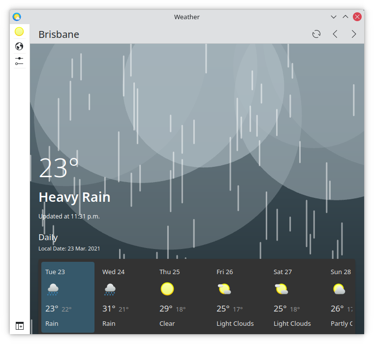

<!--
- Copyright 2020 Han Young <hanyoung@protonmail.com>
- Copyright 2020 Devin Lin <espidev@gmail.com>
- SPDX-License-Identifier: GPL-2.0-or-later
-->

# KWeather 

<a href='https://flathub.org/apps/details/org.kde.kweather'></a>

A convergent weather application for Plasma.

## Features
* Daily and hourly weather data from various weather backends
* Plasmoids that can be used on desktop and mobile

## Links
* Project page: https://invent.kde.org/plasma-mobile/kweather
* Issues: https://invent.kde.org/plasma-mobile/kweather/-/issues
* Development channel: https://matrix.to/#/#plasmamobile:matrix.org

## Dependencies
If you are the packaging the application, it's worth looking at the [neon deb package](https://invent.kde.org/neon/mobile/kweather).
* KWeatherCore (https://invent.kde.org/libraries/kweathercore)
* Kirigami
* KQuickCharts
* Qt Quick Controls
* Qt Quick Shapes

## Installing
```
mkdir build
cd build
cmake .. # add -DCMAKE_BUILD_TYPE=Release to compile for release
make
sudo make install
```

## Online APIs used
* api.met.no - Weather data, sunrise/sunset data
* geonames.org - Coordinates -> Timezone
* geoip.ubuntu.com - IP -> Coordinates
* openweathermap.org - Weather data (optional, requires API token)

## Gallery





